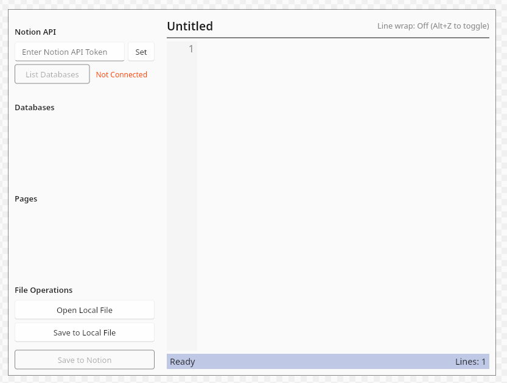

# Notion Editor

A desktop application that allows you to edit your Notion pages directly using the Notion API.



## Features

- Connect to the Notion API using your integration token
- Browse and list available databases
- View and edit pages in your Notion workspace
- Update page content directly through the API
- Local file support for importing/exporting content
- Line numbering and word wrap toggling
- Keyboard shortcuts for common operations

## Prerequisites

- Rust and Cargo installed
- A Notion integration token (see setup instructions below)
- On Linux, ensure you have a native file dialog backend installed (e.g., `zenity` or `kdialog`) for local file operations
  ```bash
  sudo apt install zenity    # or kdialog
  ```

## Building and Running

```bash
# Clone the repo
git clone https://github.com/yourusername/notion-editor.git
cd notion-editor

# Build the application
cargo build --release

# Run the application
cargo run --release
```

## Setting up Notion API Integration

1. Go to [https://www.notion.so/my-integrations](https://www.notion.so/my-integrations)
2. Click "New integration"
3. Give your integration a name (e.g., "Notion Editor")
4. Set the capabilities you want (at minimum, you need read/write content permissions)
5. Click "Submit" to create the integration
6. Copy the "Internal Integration Token" - this is what you'll use in the app
7. For each database or page you want to access, share it with your integration:
   - Open the database/page in Notion
   - Click "Share" in the top right
   - In the "Add people, groups, or integrations" field, select your integration

## Using the Application

1. Start the application
2. Paste your Notion API token and click "Set"
3. Click "List Databases" to see available databases
4. Click on a database to see its pages
5. Click on a page to load its content
6. Edit the content in the main editor
7. Click "Save to Notion" to update the page

### Keyboard Shortcuts

- `Ctrl+S`: Save content to Notion
- `Ctrl+O`: Open local file
- `Ctrl+L`: Save to local file
- `Alt+Z`: Toggle word wrap

## Configuration

The application stores your Notion token in:
- `~/.notion_token` on Unix-like systems
- `C:\Users\YourUsername\.notion_token` on Windows

You can also set the token as an environment variable:
```bash
export NOTION_TOKEN=your_token_here
```

## Limitations

- Currently only supports paragraph blocks in Notion
- Complex Notion blocks (tables, code blocks, etc.) are not yet supported
- No support for creating new pages or databases

## License

MIT